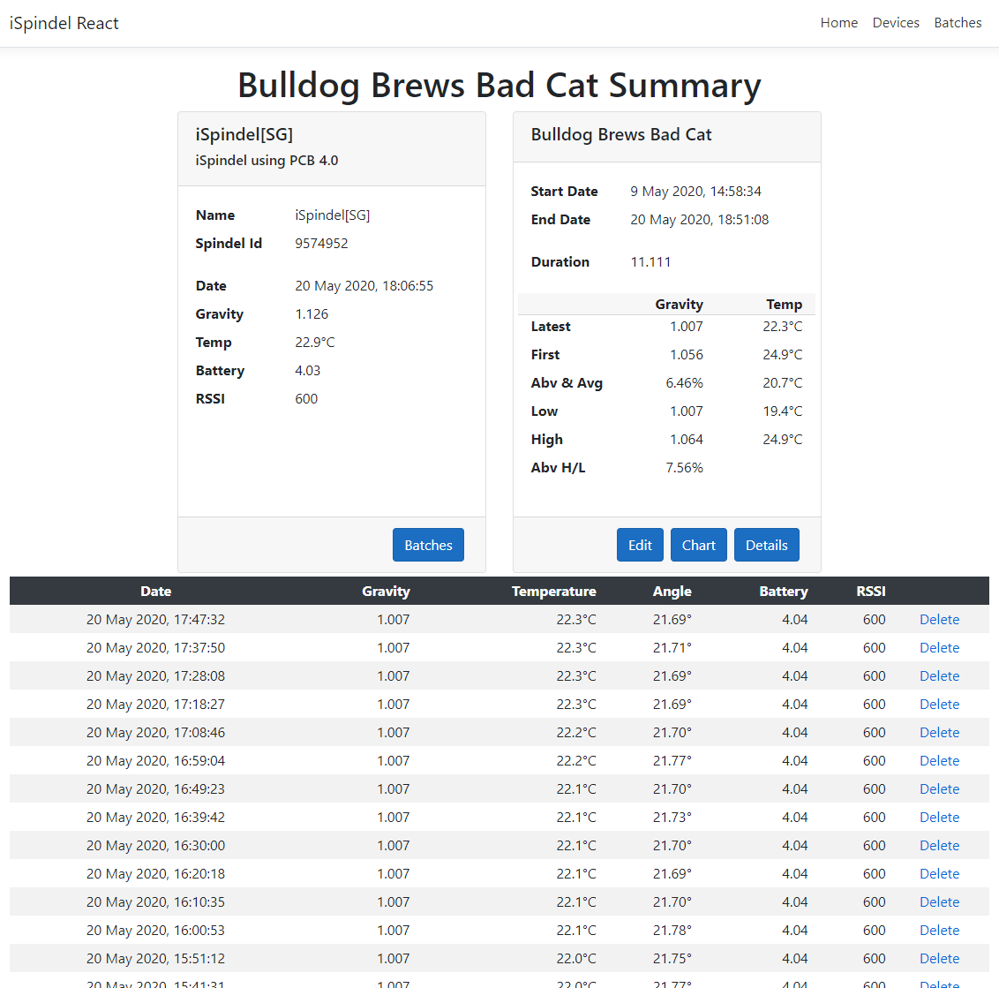
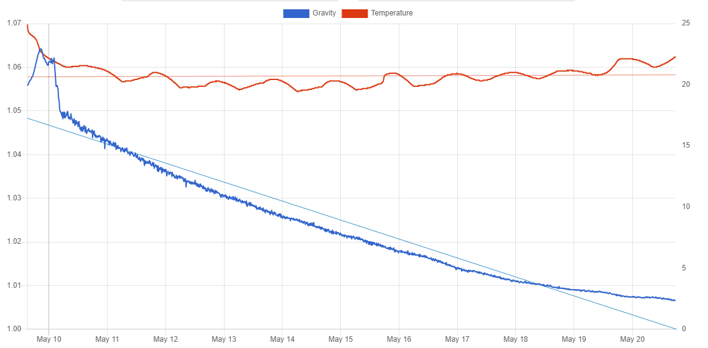
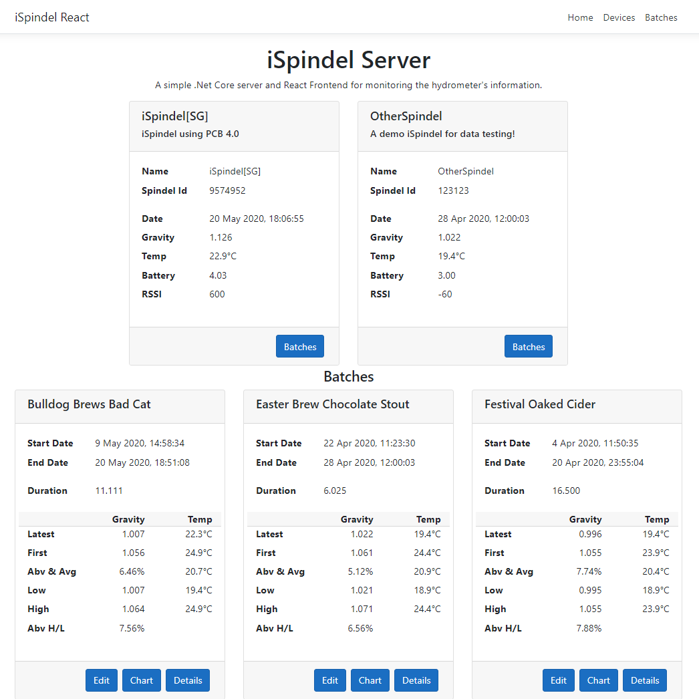

# iSpindelReact
## iSpindel Server C# .net core with React UI

This is a basic service for recording information from an *iSpindel* written using .net core, entity framework and Angular IO.
It takes input from iSpindel set to use HTTP.

This was written primarily as an exercise in learning some new languages and frameworks.
I've always found having a practicle application to write helps with the learning.
There were certainly some challenges with complex entity framework joins and with adding a chart.
This is in React, and it part of a series devloping with different UI frameworks.

It allows the use of SQLServer/LocalDb or Sqlite.
The database is created automatically and there are just three basic tables to store the information: Device, Batch and Log.
Change ServerType to 1 in the appsettings to use Sqlite instead of SQL Server/LocalDb

*Devices* are created by the first log sent by an iSpindel.
It matches the name field set up on the device, so this must be unique if you are using more than one device.
Once created you can only change the description and the token fields.
A future development could be to use the token to ensure that log calls are valid,
but as I expect this to be run on a private network I've not felt it necessary to add that code.

For each device you can create a *Batch* which will have a start date of when you created it.
Description can be changed for a batch and a batch can be manually ended.
A batch will automatically be ended if a new batch is created on the same device.

 
 
 
 
 
